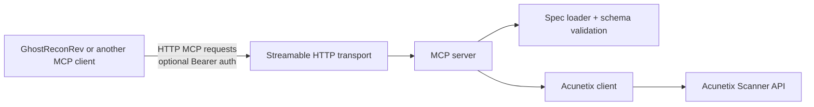
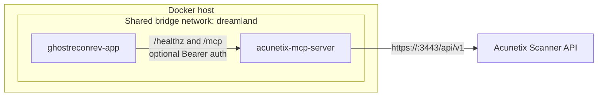

# Acunetix MCP Server

This project exposes the Acunetix Scanner API as a streamable HTTP MCP server.

## Request Transport Map



## Docker Topology



## Tool Inventory

The full generated inventory is in [docs/tool-inventory.md](docs/tool-inventory.md).

## Configuration

Copy [`.env.example`](.env.example) into `.env`.

The following settings are required.

- `ACUNETIX_BASE_URL`: Full Acunetix API base URL, for example `https://host.docker.internal:3443/api/v1`
when the scanner runs on the Docker host.
- `ACUNETIX_API_KEY`: Acunetix API key sent as the `X-Auth` header.

## Docker

Use Docker Compose.

```bash
cp .env.example .env
docker compose build --no-cache
docker compose up
```

## GhostReconRev Integration

When both stacks run on the shared `dreamland` bridge, the integration works
as follows.

- GhostReconRev reaches MCP at `http://acunetix-mcp-server:3000/mcp`.
- GhostReconRev health-checks MCP at `http://acunetix-mcp-server:3000/healthz`.
- The MCP container then reaches the Acunetix API defined by `ACUNETIX_BASE_URL`.

GhostReconRev resolves required MCP tool names dynamically against the runtime
tool inventory.
